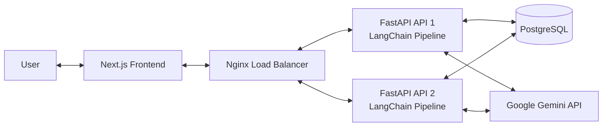
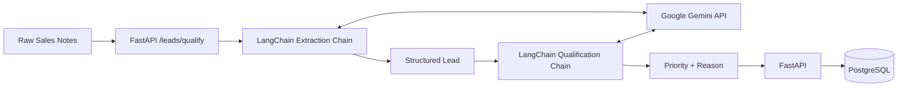

# LeadTrack

> A lightweight AI-assisted CRM prototype for capturing, managing, and qualifying sales leads.

LeadTrack combines a **Next.js dashboard**, **FastAPI REST API**, **PostgreSQL**, and a **two-step Gemini + LangChain pipeline**.

The backend is designed to run as **two FastAPI instances behind Nginx**, demonstrating REST API development, database integration, AI workflows, Dockerization, and basic load balancing in one project.

---

## What LeadTrack Does

A sales user can:

- Add and view leads
- Store lead information in PostgreSQL
- Submit unstructured sales notes
- Extract structured lead information using Gemini
- Generate an AI-based follow-up priority
- Access backend functionality through REST APIs
- Run multiple FastAPI instances behind Nginx

### Example

**Input**

> Spoke with Riya Sharma from Acme Hotels. She is interested in purchasing a hotel property and wants to move quickly. Her email is riya@acmehotels.com.

**AI Extraction**

```json
{
  "name": "Riya Sharma",
  "email": "riya@acmehotels.com",
  "company": "Acme Hotels",
  "notes_summary": "Riya Sharma from Acme Hotels is interested in purchasing a hotel property and wants to move quickly."
}
```

**AI Qualification**

```json
{
  "priority": "high",
  "reason": "The prospect has clear purchase intent and wants to move quickly."
}
```

---

## Architecture



### How the Request Flows

```text
User
 ↓
Next.js Frontend
 ↓
Nginx Load Balancer
 ↓
One FastAPI Instance
 ↓
LangChain Pipeline
 ↓
Google Gemini API
 ↑
AI Response
 ↑
FastAPI
 ↓
PostgreSQL
 ↑
Saved Lead
 ↑
FastAPI
 ↑
Nginx
 ↑
Next.js
 ↑
User
```

Nginx chooses one of the available FastAPI instances for a request.

Both FastAPI instances run the same application and can communicate with the same PostgreSQL database and Gemini API.

LangChain is **not a separate server**. It is part of the FastAPI backend code and is used to organize the prompts, Gemini calls, and structured AI responses.

---

## AI Pipeline



The AI workflow uses **two separate LangChain chains**.

### 1. Extraction Chain

The first chain converts unstructured sales notes into structured information such as:

- Name
- Email
- Company
- Notes summary

Example:

```text
"Riya from Acme Hotels wants to purchase a hotel soon."
```

becomes:

```json
{
  "name": "Riya",
  "email": "",
  "company": "Acme Hotels",
  "notes_summary": "Riya from Acme Hotels is interested in purchasing a hotel soon."
}
```

### 2. Qualification Chain

The second chain takes the extracted lead information and assigns a follow-up priority:

```text
high
medium
low
```

It also generates a short reason explaining the decision.

The final lead can then be stored in PostgreSQL.

---

## Tech Stack

| Layer                         | Technology                 |
| ----------------------------- | -------------------------- |
| Frontend                      | Next.js, React, TypeScript |
| Backend                       | FastAPI, Python            |
| ORM                           | SQLAlchemy                 |
| Database                      | PostgreSQL                 |
| AI Model                      | Google Gemini              |
| LLM Orchestration             | LangChain                  |
| Reverse Proxy / Load Balancer | Nginx                      |
| Containers                    | Docker, Docker Compose     |

---

## Project Structure

```text
leadtrack/
├── Backend/
│   ├── main.py
│   ├── database.py
│   ├── models.py
│   ├── schemas.py
│   ├── ai_pipeline.py
│   └── requirements.txt
│
├── Frontend/
│   ├── app/
│   ├── components/
│   ├── lib/
│   ├── package.json
│   └── ...
│
├── Ngnix/
│   └── nginx.conf
│
├── Dockerfile
├── docker-compose.yml
├── .env.example
├── .gitignore
└── README.md
```

Local-only files such as `.env`, `.venv`, `node_modules`, and build output should not be committed to Git.

---

## API Overview

FastAPI automatically provides interactive Swagger API documentation.

When FastAPI is running locally:

```text
http://localhost:8000/docs
```

When the backend is running through Nginx with Docker:

```text
http://localhost:8080/docs
```

Main API functionality includes:

| Method | Endpoint         | Purpose                                         |
| ------ | ---------------- | ----------------------------------------------- |
| `GET`  | `/health`        | Check whether the FastAPI instance is running   |
| `GET`  | `/leads`         | Retrieve stored leads                           |
| `POST` | `/leads`         | Create a lead manually                          |
| `POST` | `/leads/qualify` | Extract, qualify, and store a lead using Gemini |

The exact CRUD routes available in the current backend can always be checked through Swagger at `/docs`.

---

# Local Development

## 1. Clone the Repository

```bash
git clone <your-repository-url>
cd leadtrack
```

---

## 2. Configure Backend Environment Variables

Create a `.env` file in the **root directory**:

```text
leadtrack/
├── .env
├── Backend/
├── Frontend/
└── docker-compose.yml
```

Example:

```env
GEMINI_API_KEY=your_gemini_api_key
GEMINI_MODEL=gemini-3.5-flash-lite
```

The real `.env` file should never be committed to GitHub.

A safe `.env.example` file can be committed instead:

```env
GEMINI_API_KEY=replace_with_your_google_ai_studio_key
GEMINI_MODEL=gemini-3.5-flash-lite
```

---

## 3. Create the Python Virtual Environment

Move into the backend:

```bash
cd Backend
```

Create the virtual environment:

```bash
python3 -m venv .venv
```

Activate it on macOS/Linux:

```bash
source .venv/bin/activate
```

Install the dependencies:

```bash
python3 -m pip install -r requirements.txt
```

The `.venv` directory keeps LeadTrack's Python packages isolated from the system Python installation.

---

## 4. Start PostgreSQL

PostgreSQL can be started independently using Docker.

From the project root:

```bash
docker compose up -d db
```

For local FastAPI development, PostgreSQL is exposed through:

```text
localhost:5432
```

This allows the FastAPI application running directly on the Mac to communicate with PostgreSQL running inside Docker.

---

## 5. Start FastAPI Locally

Move into the backend directory:

```bash
cd Backend
```

Activate the virtual environment if it is not already active:

```bash
source .venv/bin/activate
```

Start FastAPI:

```bash
python3 -m uvicorn main:app --reload
```

Open Swagger:

```text
http://localhost:8000/docs
```

Test the health endpoint:

```text
GET /health
```

A successful response should return HTTP status:

```text
200 OK
```

---

## 6. Configure the Frontend

For a frontend connecting directly to the locally running FastAPI backend, create:

```text
Frontend/.env.local
```

and use:

```env
NEXT_PUBLIC_API_URL=http://localhost:8000
```

If the backend is running through Docker and Nginx instead, use:

```env
NEXT_PUBLIC_API_URL=http://localhost:8080
```

---

## 7. Start Next.js

Move into the frontend directory:

```bash
cd Frontend
```

Install dependencies:

```bash
npm install
```

Start the development server:

```bash
npm run dev
```

Open:

```text
http://localhost:3000
```

---

# Docker Architecture

The backend Docker setup contains:

- PostgreSQL
- FastAPI API 1
- FastAPI API 2
- Nginx

```text
                    ┌────────────────────┐
                    │       Nginx        │
                    │   localhost:8080   │
                    └─────────┬──────────┘
                              │
                 ┌────────────┴────────────┐
                 │                         │
                 ▼                         ▼
        ┌─────────────────┐       ┌─────────────────┐
        │     FastAPI     │       │     FastAPI     │
        │      API 1      │       │      API 2      │
        │                 │       │                 │
        │ LangChain       │       │ LangChain       │
        └───────┬─────────┘       └────────┬────────┘
                │                          │
                └────────────┬─────────────┘
                             │
                             ▼
                       ┌────────────┐
                       │ PostgreSQL │
                       └────────────┘

FastAPI API 1  <────>  Google Gemini API
FastAPI API 2  <────>  Google Gemini API
```

Nginx acts as the entry point and distributes requests between the two FastAPI instances.

Both FastAPI instances:

- Run the same backend application
- Connect to the same PostgreSQL database
- Use the same LangChain AI pipeline
- Communicate with the Gemini API

---

## Running the Backend with Docker

From the project root:

```bash
docker compose up --build
```

The API can then be accessed through Nginx:

```text
http://localhost:8080
```

Swagger:

```text
http://localhost:8080/docs
```

To check running containers:

```bash
docker compose ps
```

To stop the stack:

```bash
docker compose down
```

---

## Environment Variables

LeadTrack keeps secrets and environment-specific configuration outside the source code.

Example:

```env
GEMINI_API_KEY=your_secret_api_key
GEMINI_MODEL=gemini-3.5-flash-lite
```

The backend reads these values using environment variables instead of hard-coding them inside Python files.

This provides several benefits:

- API keys remain private
- Different environments can use different configuration
- Docker can inject configuration into containers
- Secrets do not need to be pushed to GitHub
- Model configuration can be changed without rewriting application code

---

## `.env` vs `.venv`

These two names look similar, but they serve completely different purposes.

### `.env`

Stores configuration and secrets.

Example:

```env
GEMINI_API_KEY=secret_key
GEMINI_MODEL=gemini-3.5-flash-lite
```

Think of it as the application's **private configuration file**.

### `.venv`

Stores the isolated Python environment and installed Python libraries.

It contains packages such as:

```text
FastAPI
SQLAlchemy
LangChain
python-dotenv
langchain-google-genai
```

Think of it as the backend's **private Python workspace**.

Neither `.env` nor `.venv` should be committed to GitHub.

---

## Git Ignore

Important local files should be ignored:

```gitignore
# Python
__pycache__/
*.py[cod]

# Python virtual environments
.venv/
venv/
Backend/.venv/

# Environment variables
.env
.env.*
!.env.example

# Next.js / Node
node_modules/
.next/
Frontend/node_modules/
Frontend/.next/
Frontend/.env.local

# macOS
.DS_Store

# IDE
.vscode/
.idea/
```

---

## Current Development Status

- [x] Next.js frontend foundation
- [x] FastAPI REST backend
- [x] PostgreSQL integration
- [x] SQLAlchemy ORM
- [x] Lead CRUD foundation
- [x] Gemini API integration
- [x] LangChain extraction chain
- [x] LangChain qualification chain
- [x] Structured Gemini responses
- [x] Local Python virtual environment
- [x] Local Gemini pipeline testing
- [x] Local FastAPI startup testing
- [x] Local FastAPI + PostgreSQL connection
- [x] Swagger API documentation
- [x] `/health` endpoint testing
- [x] Two FastAPI service architecture
- [x] Nginx load-balancer configuration
- [x] Docker backend configuration
- [ ] Full Docker stack retest after Gemini migration
- [ ] Full frontend-to-backend end-to-end testing
- [ ] Production deployment
- [ ] Live demo URL

---

## Why I Built LeadTrack

LeadTrack is a hands-on project designed to understand how the different layers of a modern backend/full-stack application connect.

```text
User
 ↓
Frontend
 ↓
REST API
 ↓
Business Logic
 ↓
AI Pipeline
 ↓
Database
 ↓
Containers / Infrastructure
```

Instead of learning FastAPI, PostgreSQL, SQLAlchemy, Docker, Nginx, and LLM APIs as completely separate technologies, LeadTrack combines them into one practical CRM workflow.

---

## Future Improvements

- Authentication and user accounts
- Role-based access control
- Lead searching and filtering
- Pagination
- More advanced AI qualification rules
- Async/background AI processing
- Automated backend tests
- Frontend tests
- CI/CD pipeline
- Production deployment
- Monitoring and structured logging
- Improved error handling
- Frontend analytics/dashboard improvements
- Frontend Dockerization

---

## Author

**Swarnadip Dasgupta**

Built as a hands-on project to learn backend development, REST API design, PostgreSQL, SQLAlchemy, Docker, Nginx load balancing, and practical LLM integration using Gemini and LangChain.
