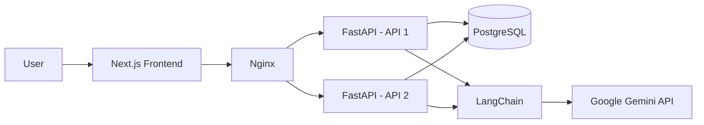
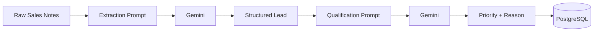

# LeadTrack

> A lightweight AI-assisted CRM prototype for capturing, managing, and qualifying sales leads.

LeadTrack combines a **Next.js dashboard**, **FastAPI REST API**, **PostgreSQL**, and a **two-step Gemini + LangChain pipeline**. The backend is designed to run as **two FastAPI instances behind Nginx**, demonstrating API development, database integration, AI workflows, Dockerization, and basic load balancing in one project.

---

## What LeadTrack Does

A sales user can:

- Add and view leads
- Store lead details in PostgreSQL
- Submit unstructured sales notes
- Extract structured lead information with Gemini
- Assign an AI-generated follow-up priority
- Access the backend through REST APIs
- Run multiple backend instances behind Nginx

### Example

**Input**

> Spoke with Riya Sharma from Acme Hotels. She is interested in purchasing a hotel property and wants to move quickly. Her email is riya@acmehotels.com.

**AI extraction**

```json
{
  "name": "Riya Sharma",
  "email": "riya@acmehotels.com",
  "company": "Acme Hotels",
  "notes_summary": "Riya Sharma from Acme Hotels is interested in purchasing a hotel property and wants to move quickly."
}
```

**AI qualification**

```json
{
  "priority": "high",
  "reason": "The prospect has clear purchase intent and wants to move quickly."
}
```

---

## Architecture



### AI Pipeline



The AI workflow intentionally uses **two separate LangChain chains**:

1. **Extraction chain** — converts unstructured notes into structured lead data.
2. **Qualification chain** — uses the extracted information to assign a `high`, `medium`, or `low` follow-up priority.

---

## Tech Stack

| Layer                         | Technology                 |
| ----------------------------- | -------------------------- |
| Frontend                      | Next.js, React, TypeScript |
| Backend                       | FastAPI, Python            |
| ORM                           | SQLAlchemy                 |
| Database                      | PostgreSQL                 |
| AI                            | Google Gemini API          |
| LLM Orchestration             | LangChain                  |
| Reverse Proxy / Load Balancer | Nginx                      |
| Containers                    | Docker, Docker Compose     |

---

## Project Structure

```text
leadtrack/
├── Backend/
│   ├── main.py
│   ├── database.py
│   ├── models.py
│   ├── schemas.py
│   ├── ai_pipeline.py
│   └── requirements.txt
│
├── Frontend/
│   ├── app/
│   ├── components/
│   ├── lib/
│   ├── package.json
│   └── ...
│
├── Ngnix/
│   └── nginx.conf
│
├── Dockerfile
├── docker-compose.yml
├── .env.example
├── .gitignore
└── README.md
```

> `.env`, `.venv`, `node_modules`, build output, and other local-only files should not be committed.

---

## API Overview

FastAPI automatically exposes interactive API documentation when the backend is running:

```text
http://localhost:8000/docs
```

When using Nginx through Docker Compose:

```text
http://localhost:8080/docs
```

Main API responsibilities include:

| Method      | Endpoint         | Purpose                                         |
| ----------- | ---------------- | ----------------------------------------------- |
| `GET`       | `/health`        | Check whether the API instance is alive         |
| `GET`       | `/leads`         | Fetch leads                                     |
| `POST`      | `/leads`         | Create a lead                                   |
| `POST`      | `/leads/qualify` | Extract, qualify, and store a lead using Gemini |
| `PUT/PATCH` | Lead endpoint    | Update lead information                         |
| `DELETE`    | Lead endpoint    | Remove a lead                                   |

> Exact CRUD routes can be viewed in Swagger at `/docs`.

---

## Local Development

### 1. Clone the repository

```bash
git clone <your-repository-url>
cd leadtrack
```

### 2. Create the backend environment file

Create `.env` in the project root:

```env
GEMINI_API_KEY=your_gemini_api_key
GEMINI_MODEL=gemini-3.7-flash
```

Never commit the real `.env` file.

### 3. Create a Python virtual environment

```bash
cd Backend
python3 -m venv .venv
source .venv/bin/activate
```

Install dependencies:

```bash
python3 -m pip install -r requirements.txt
```

### 4. Start PostgreSQL with Docker

From the project root:

```bash
docker compose up -d db
```

For local FastAPI development, PostgreSQL should be exposed on:

```text
localhost:5432
```

### 5. Start FastAPI locally

```bash
cd Backend
source .venv/bin/activate
python3 -m uvicorn main:app --reload
```

Open:

```text
http://localhost:8000/docs
```

### 6. Start the frontend

In another terminal:

```bash
cd Frontend
npm install
npm run dev
```

Open:

```text
http://localhost:3000
```

---

## Docker Architecture

```text
                ┌───────────────┐
                │     Nginx     │
                │ localhost:8080│
                └───────┬───────┘
                        │
             ┌──────────┴──────────┐
             ▼                     ▼
        ┌─────────┐           ┌─────────┐
        │  api1   │           │  api2   │
        │ FastAPI │           │ FastAPI │
        └────┬────┘           └────┬────┘
             │                     │
             └──────────┬──────────┘
                        ▼
                  ┌────────────┐
                  │ PostgreSQL │
                  └────────────┘

FastAPI ── LangChain ──> Gemini API
```

To build and start the stack:

```bash
docker compose up --build
```

Then access the API through Nginx:

```text
http://localhost:8080
```

---

## Environment Variables

The application keeps secrets and configuration outside the source code.

Example `.env.example`:

```env
GEMINI_API_KEY=replace_with_your_google_ai_studio_key
GEMINI_MODEL=gemini-3.7-flash
```

Why?

- API keys should never be hard-coded.
- Local and deployed environments may use different values.
- Docker can inject the same variables into containers.
- The repository remains safe to share publicly.

---

## Current Development Status

- [x] FastAPI REST backend
- [x] PostgreSQL + SQLAlchemy integration
- [x] Lead CRUD foundation
- [x] Gemini API integration
- [x] LangChain extraction pipeline
- [x] LangChain qualification pipeline
- [x] Local backend testing
- [x] Dockerized backend foundation
- [x] Two FastAPI service design
- [x] Nginx reverse proxy / load balancer
- [x] Next.js frontend foundation
- [ ] Full end-to-end regression testing
- [ ] Production deployment
- [ ] Live demo URL

---

## Why I Built This

LeadTrack is a learning-focused backend/full-stack project built to understand how real application layers connect:

```text
Frontend
   ↓
REST API
   ↓
Business Logic
   ↓
AI Pipeline
   ↓
Database
   ↓
Containers / Infrastructure
```

Instead of treating FastAPI, PostgreSQL, Docker, Nginx, and LLM APIs as isolated technologies, this project combines them into one small CRM workflow.

---

## Future Improvements

- Authentication and user accounts
- Lead search and filtering
- Pagination
- Better AI qualification rules
- Async/background AI processing
- Automated tests
- CI/CD
- Production deployment
- Monitoring and logging
- Improved frontend analytics

---

## Author

**Swarnadip Dasgupta**

Built as a hands-on project to learn backend development, API design, PostgreSQL, Docker, load balancing, and practical LLM integration.
